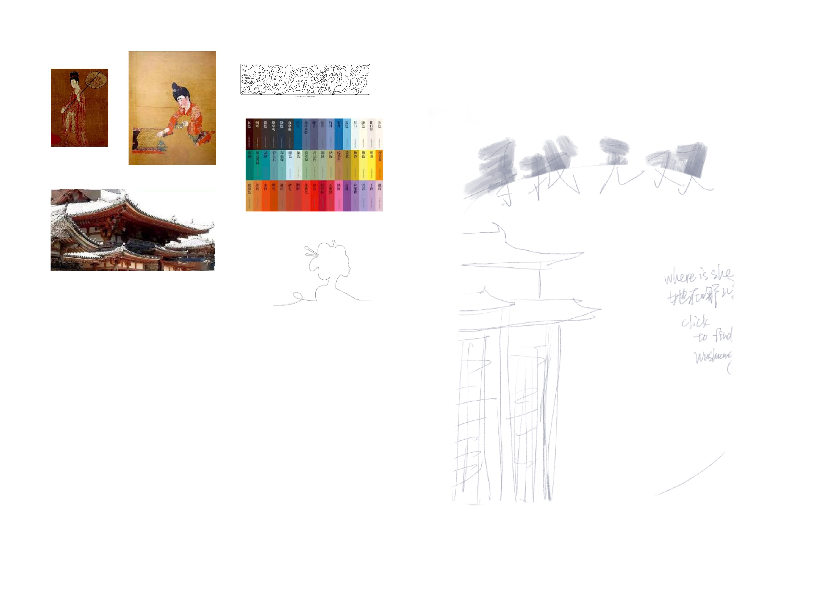

Nov 4th

1.Give the snow random size, opacity and speed.
2.Changed the font of the book title to a Tang dynasty caligraphy style
3.testing the colors for the text, circle and the architecture.

Oct 28th

0ct 21st
The book I'm choosing is 'Search for Wu Shuang' by Xiaobo Wang. I have recently reread it after my first read several years ago. I share the same name as the character that the main character is searching for throughtout the book. Which makes the book particularly clso to me at heart.

The book is set in Tang Dynasty. I would love to include Tang dynasty architecture elements in the design. 

Throughout the book, main character Xianke Wang is searching for his cousin wushuang in order to fulfill the engagement made by their family when they were young. It is beautiful to me that wushuang, who symbolizes a pursuit of meaning, love, and personal identity were never to be found till the end of the book. 

I would like the design to be interactive. I'm thinking that the design encourages the audience to click around in order to 'find wushuang'. And randomly 'wushuang' appears as a blurry silhoutte of a girl.

I would also like to experiment with dynamic backgrounds or changing colors inspired by the Tang Dynasty palette (e.g., deep reds, golds, jade green). These colors could shift subtly as the user interacts with the page, reflecting the journey and sense of time passing in the story.

This might be a little challenging but I'm consider adding ancient Chinese calligraphy strokes that appear as the user clicks, forming parts of Wushuang’s name, and then disappearing again, symbolizing her elusive nature.

I'm to sure wht the image is not showing but I upload the file!
